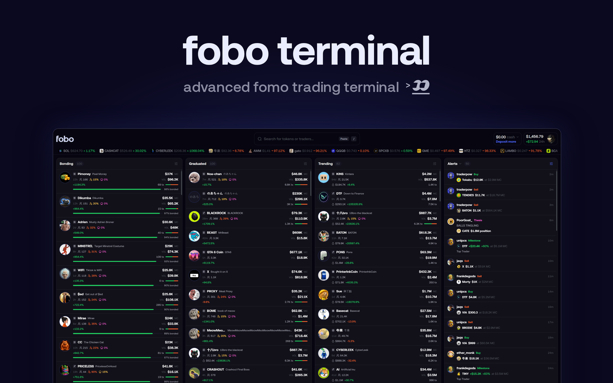
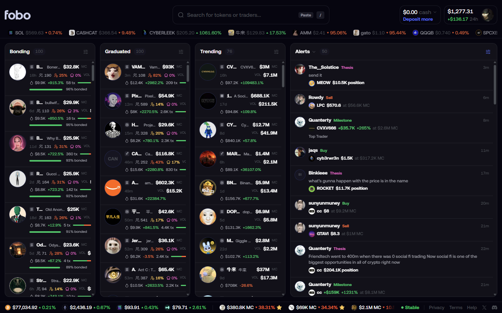
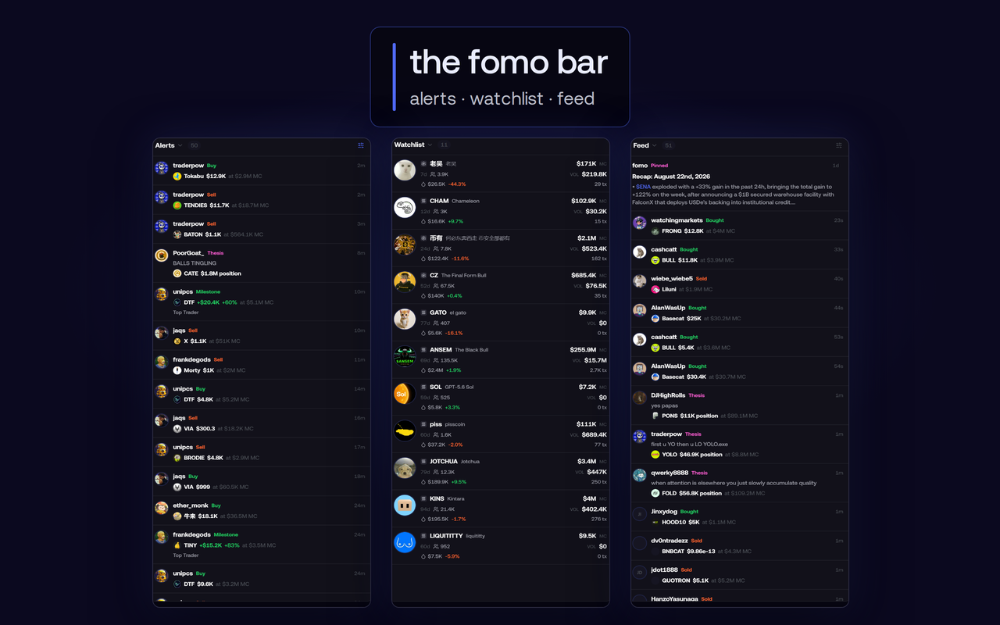
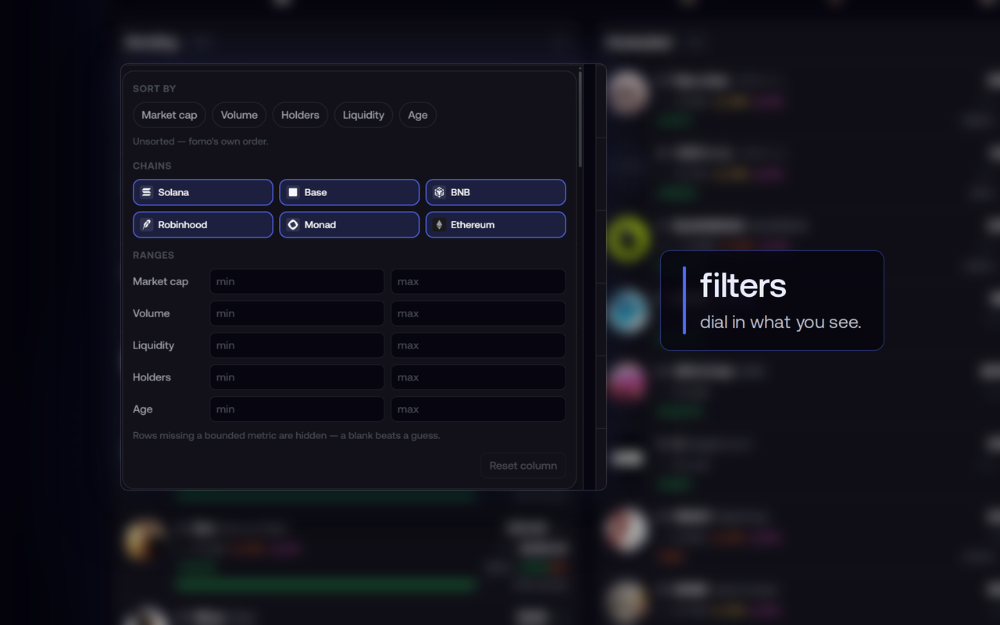
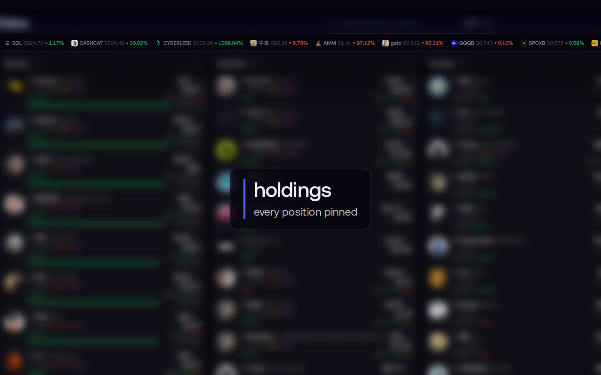

<div align="center">


# fobo terminal

**The home screen [fomo.family](https://fomo.family/) doesn't have.**
Bonding, Graduated and Trending side by side — live, dense, and in fomo's own design language.

**[foboterminal.com](https://foboterminal.com/)**

[](LICENSE)
[](manifest.config.ts)
[](#scope-limits)



</div>

---

Independent project — not affiliated with, endorsed by, or maintained by fomo.family. It uses
fomo's own web API under your own login. [`PRIVACY.md`](PRIVACY.md) says exactly what it reads
and where that goes.

## Why

fomo has no home screen. After login `/` redirects to `/token`, which redirects to whichever
token is currently #1 trending — so you land on an arbitrary coin page. Its three interesting
subsets (Bonding, Graduated, Trending) exist only as tabs in one narrow side panel, so you can
watch exactly one of them at a time.

fobo shows all three at once.

## The terminal



Three columns — **Bonding**, **Graduated**, **Trending** — fed live from fomo's own
`wss://prod-api.fomo.family/ws`, using the Privy session already in your browser. Cards show
market cap, volume, liquidity, age, price change, trade pressure, and holder-concentration
metrics (holder count, top-10 %, dev holdings), with a bonding-curve progress bar on the
Bonding column.

Clicking a card opens that token on fomo. That is the only action a card has.

## The FOMO Panel



A side rail that switches between three fomo views, remembering its choice per tab:

- **Alerts** — the trading activity of the traders you follow: swaps and transfers,
  multi-user buy/sell clusters, theses, and profit milestones. Backfilled from
  `GET /feed/tradingActivity` and updated live over the same WebSocket (topic
  `trading_activity`). Scrolling pages further back; clicking a row opens the token,
  clicking a trader opens their profile.
- **Watchlist** — your starred tokens, with the same `DELETE /watchlist` un-star fomo uses.
- **Feed** — fomo's social feed, carrying its own eight filter type groups.

Alerts carry fomo's trade-size / portfolio / market-cap bounds (fomo's $1k trade-size default),
re-applied to live socket frames where the fields exist. fomo's alert ding is replicated, with a
toggle in the popup. Side and visibility are set in the toolbar popup; the width (280–560 px) is
dragged on the panel's inner edge.

Rows on chains fobo cannot name are dropped rather than mislabelled, and a row only ever shows
fields the feed actually carried.

## Filters and sort



Per column: sort by market cap / volume / holders / liquidity / age (highest or lowest first);
filter by chain and by min/max market cap, liquidity, holders, volume and token age. Saved in
`chrome.storage.sync`, so they survive reloads and follow your Chrome profile. The Graduated
column defaults to newest-first.

## Your positions



A slim strip under the top bar — modelled on Axiom Pulse's holdings bar, drawn in fomo's palette
— showing every token the account currently holds: icon, symbol, current value (amount ×
fomo's price), and the trade's PnL percent using fomo's own open-position arithmetic (realized +
unrealized over cost basis, from `GET /v2/users/:id/balances`, the endpoint fomo's positions list
reads). USDC cash rows are not holdings; unpriceable rows are dropped. Sorted by value, polled on
fomo's 10 s header cadence, absent entirely when there is nothing to show. Clicking a chip opens
the token on fomo.

Below it, fomo's own footer is recreated one-to-one: BTC/ETH/SOL/HYPE prices on the left, your
watchlist as a drag-scrollable ticker (newest-starred first, capped at 15, market cap under $10B
shown as MC, otherwise price — fomo's own display rule), and on the right the status dot
(`status.fomo.family`), Privacy/Terms/Help, and the X/Discord icons. Prices refresh every minute
and status every five, matching fomo's intervals.

## Everything else that's in there

- **Header dropdowns** — fomo's cash menu (Deposit / Withdraw) and profile menu (Your profile,
  Manage account, Settings, Transfers, Referrals, Log out) recreated with fomo's own icons.
  Modal-backed items step aside and drive fomo's real menu.
- **Render suppression** — while the terminal is visible, fomo's page underneath skips
  layout and paint (`content-visibility`), so the landing token page's chart costs ~nothing.
  Its JS and sockets keep running.
- **Tab mask** — the visible terminal shows `fomo.family/fobo-terminal` and "fobo terminal" in
  the tab. A pure display mask: fomo's router never notices, and it lifts on every handoff.
- **Visibility-aware** — every poller, the Mobula warm-up and the socket reducer pause while the
  terminal is hidden behind fomo's own pages or the tab is backgrounded, and resume with an
  immediate refresh when it comes back.
- **Socket liveness** — handshake deadline, idle watchdog, reconnect on `online` and tab focus,
  and a "stale" badge in the column headers when frames stop arriving.
- **Chain identifiers** on column cards, using fomo's own chain glyph tiles.

Not built yet: fomo's Tokens and Leaderboard side-panel tabs.

## Install

Two routes. Either way the toolbar icon toggles fobo on and off, and `Esc` dismisses the overlay
(a small `fobo` button brings it back).

### Quick install

Go to **[foboterminal.com](https://foboterminal.com/)** — it takes you to the Chrome Web Store
listing. Add it to Chrome, then open <https://fomo.family/> while signed in.

### Install from source

```bash
git clone https://github.com/0xJonty/fobo-terminal.git
cd fobo-terminal
npm install
npm run build     # typecheck + lint + tests, then a one-off build into ./dist
```

Then:

1. Open `chrome://extensions`
2. Enable **Developer mode**
3. **Load unpacked** → select the build output directory
4. Open <https://fomo.family/> while signed in

After a rebuild, hit **Reload** on the extension card — the host page needs reloading too.

## Build

```bash
npm run build     # typecheck + lint + tests, then a one-off build
npm run watch     # rebuild on every save (no checks)
npm run check     # typecheck + lint + tests only
npm run package   # checks + build, then release/fobo-terminal-<version>.zip
```

`npm run build` writes to `./dist` unless `FOBO_OUT_DIR` overrides it, and refuses to write
into a directory that is not named `dist`, is not empty, and holds no `manifest.json` — a guard
against a mistyped output path wiping something else.

## How it works

| Piece | Role |
|---|---|
| `src/content/` | The UI. Mounts a shadow root on a sibling of fomo's tree and renders the columns. |
| `src/lib/fomoSocket.ts` | Connects to fomo's WebSocket, does the challenge handshake, subscribes to all three topics. |
| `src/lib/listStore.ts` | Applies fomo's list diff protocol, mirroring their reducer exactly. |
| `src/lib/mobula.ts` | Fetches Mobula's open Pulse endpoint for the holder/risk metrics fomo's rows don't carry. |
| `src/background/` | Preferences and the toolbar toggle. Deliberately does no fetching. |

Two design notes worth knowing:

**We open our own socket rather than observing fomo's.** fomo subscribes to only one list at a
time — whichever tab its panel has open. Verified live: switching to Bonding froze
`trending_tokens` at 12 frames while `pre_graduated_tokens` climbed past 100. Passive mirroring
could only ever fill one column, so fobo is a second client of the same session instead.

**All network access happens in the page, not the service worker.** `prod-api.fomo.family` sits
behind Cloudflare bot management that rejects non-browser clients; a service-worker fetch gets a
403.

## Scope limits

- **Read-only.** Cash, portfolio value and open positions are *displayed* from fomo's own API
  (the same endpoints fomo's header and positions list read); there are no keys, no signing and
  no trade submission. Anything transactional (deposit, withdraw, buy) hands off to fomo's own
  UI.
- Profile pages and coin pages are left exactly as fomo ships them.
- Nothing is injected into fomo's JavaScript context. fobo renders into a **closed** shadow root
  on a sibling element and opens its own API connection, so it never patches `fetch`,
  `WebSocket`, or React's DOM — and fomo's scripts cannot reach into the terminal's DOM either.
  Disabling the extension leaves the site untouched.
- The Privy JWT is read from the page's own `localStorage` at connect time, sent only to fomo's
  own API, and is never persisted by the extension or logged.
- **Third parties.** Besides fomo's API, the extension talks to two other hosts from your
  browser: `fomo-api.mobula.io` (Mobula's public Pulse endpoint, for holder/risk metrics —
  polled per chain on screen while the terminal is visible) and `status.fomo.family` (fomo's
  status page). Mobula therefore sees your IP address and that you are on fomo; nothing else is
  sent to it. If either host is blocked or fomo's CSP changes, the cards simply omit those
  metrics and a single warning is logged.
- **Permissions.** `storage`, plus one host permission for `https://fomo.family/*`. No `tabs`,
  no `webRequest`, no `<all_urls>`.
- **The address bar** shows `fomo.family/fobo-terminal` while the terminal is visible (a display
  mask; fomo's router never sees it). Copying that URL gives a link that only works with the
  extension installed — anyone else lands on fomo's 404 view. Copy the token's own link from a
  card (right-click → copy link) when sharing.

## License

[MIT](LICENSE).

fomo.family's name, marks and design language belong to fomo; this project reproduces its look
to sit alongside it and claims nothing over them.
